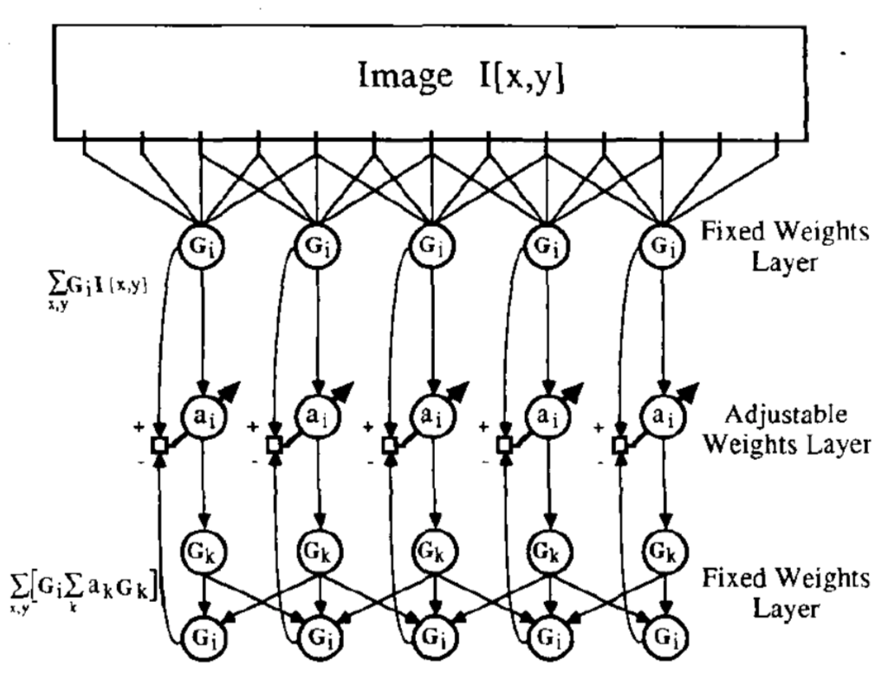
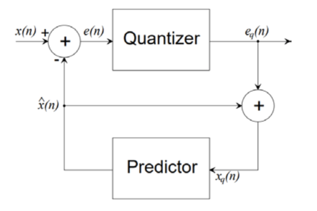
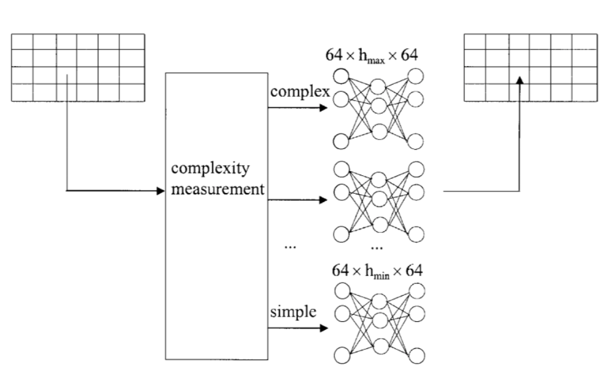
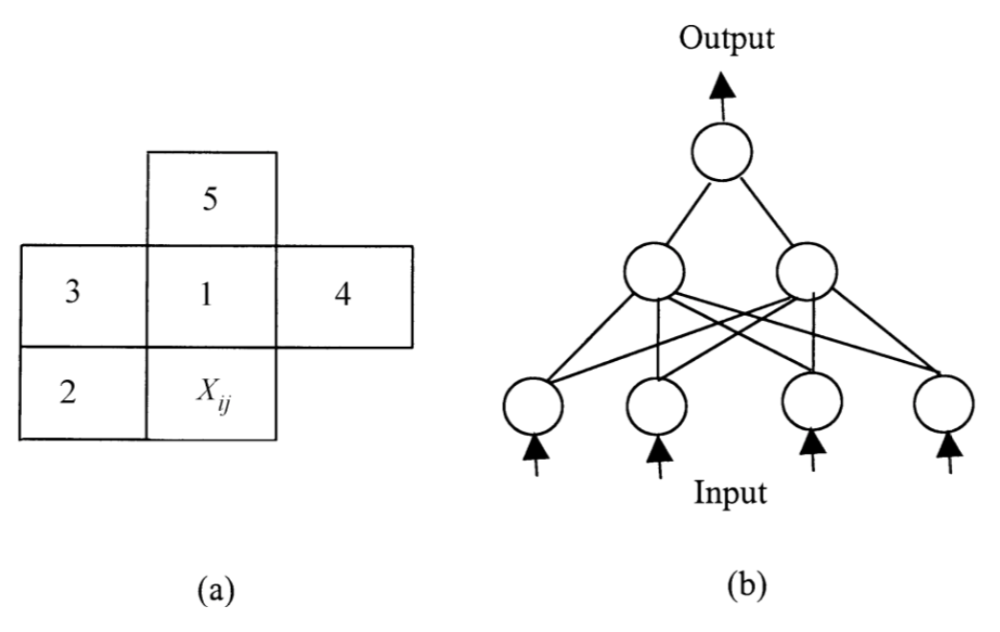
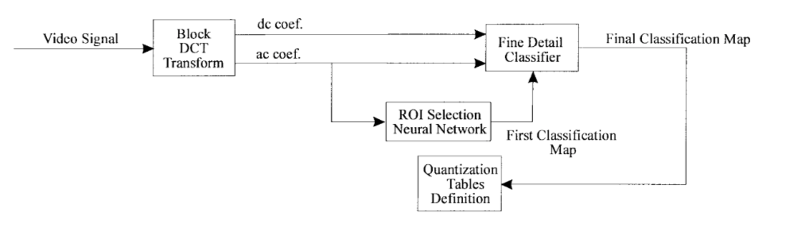
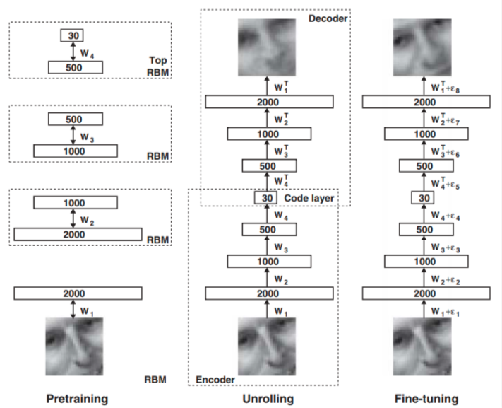
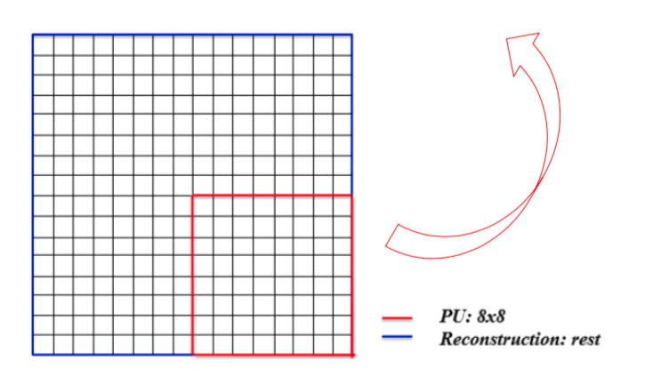
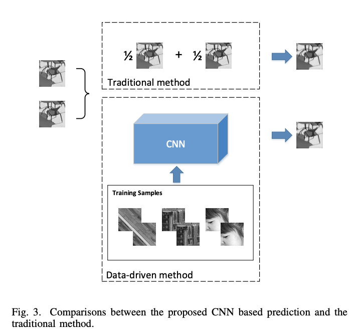
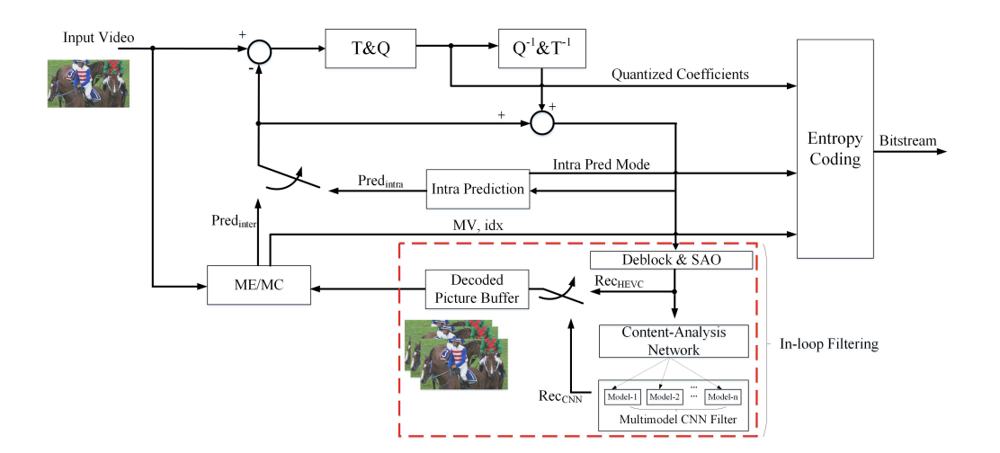
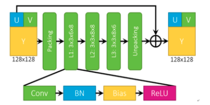

This paper is inspired by Prof. Wang in Peking University.

神经网络视频编码历史:

**起源：**

基于神经网络的编码技术源自于上世纪八十年代

三层人工神经网络用于图像变换编码~[refer](https://www.semanticscholar.org/paper/Image-compression-by-back-propagation%3A-A-of-Cottrell-Munro/6db399b4afd41d29c06bbb88c1de370a4b93f994)

**上世纪九十年代初：**

基于多层感知机的图像编码

- DPCM using a multilayer preceptron network

- Predictive Coding

**九十年代中期：**

自适应预测编码

- Complexity analysis & Entropy coding 

将图像划分为小块进行编码

利用空域临近像素作为辅助预测

**2000年左右**

1.端到端的多层感知机编码

2.由图像扩展到视频编码

**2006**

自编码开启深度学习时代 By G.E. Hinton

---

###基于深度学习的视频编码进展:

#####深度学习与视频编码

- 帧内预测
- 帧间预测
    + 分像素插值
    + 预测增强
    + 参考帧质量提升
- 环路滤波
- 模式决策
    + 编码优化

**帧内预测：**

<i class="far fa-star"></i> 数据驱动的帧内预测方法

- 基于全卷积网络
- 全连接网络
    + 单一模型：IPFCN-S(IPFCN-S-L:将网络参数减半)
    + 双模型(为DC和planar训练专门模型)：IPFCN-D(IPFCN-D-L:将网络参数减半)

[IPFCN](https://ieeexplore.ieee.org/document/8319436)

<i class="far fa-star"></i> Design Resnet for Intra 8x8 PU

[Refer](https://ieeexplore.ieee.org/document/7923719)

<i class="far fa-star"></i> 预测增强

- 训练数据生成
- 当前PU通过HEVC得到最优intra mode

<i class="far fa-star"></i> 残差网络学习

<i class="far fa-star"></i> QP: 22 27 32 37, HEVC Intra, DL Platform: Matcovnet

**帧间预测：**

<i class="far fa-star"></i> 基于深度学习的分像素插值

- 针对1/2像素设计神经网络
    + 帧间预测：分像素插值 + 图像超分

[Refer](https://ieeexplore.ieee.org/document/8319451)

[Refer](https://pigundermoon.github.io/GVCNN/GVCNN.html)

<i class="far fa-star"></i> 帧间预测增强

- 利用空域-时域联合信息
    + 空域周边像素重建
    + 时域参考像素

[Refer](https://ieeexplore.ieee.org/document/8486600)

- 提升预测准确性
    + [帧间双向预测（BIP）](https://ieeexplore.ieee.org/document/8493529)

    

    + [虚拟参考帧生成](https://ieeexplore.ieee.org/document/8451465)

    

**环路滤波**

<i class="far fa-star"></i> 基于整帧的处理：SRCNN

[SRCNN](https://ieeexplore.ieee.org/document/7528223)

<i class="far fa-star"></i>帧内编码后处理

- Post processing, All Intra
- QP: 22,27,32,37

[Refer](https://arxiv.org/abs/1608.06690)

<i class="far fa-star"></i>基于内容特性的神经网络环路滤波

- 针对不同内容特性的视频图像训练CNN模型
- Content analysis + CNN in-loop filter

[Refer](https://ieeexplore.ieee.org/stamp/stamp.jsp?arnumber=8630681)

<i class="far fa-star"></i>智能编码与VVC(JVET-N0110)

- ALF之后
- 浅层卷积神经网络
- 亮度分量与色度分量共享网络
- 帧级开关、CTU级开关、32x32块开关

<i class="far fa-star"></i>智能编码与VVC(JVET-N0133)

- 代替Deblock, SAO, ALF 
- 辅助输入信息：块划分结构和QP
- SE（Squeeze and Excitation）block 

<i class="far fa-star"></i>智能编码与VVC(JVET-N0169)

- CNNLF的位置
- 辅助输入信息：QP Map
- 并行化：分块滤波

<i class="far fa-star"></i>智能编码与VVC(JVET-N0254)

- Dense Residual CNN 
- 深度可分离卷积（DSC）减少参数量

<i class="far fa-star"></i>智能编码与AVS3

- QP分段训练残差网络
- 代替Deblock,SAO,ALF
- 帧级开关、CTU级开关

**帧内编码模式决策**

<i class="far fa-star"></i>基于CNN的CU模式决策

- 分析CU块纹理
- 减少CU模式的数目
- 引入QP作为辅助信息

<i class="far fa-star"></i>实现

- Adding FastCUMode()
- into xCompressCU

[Refer](https://ieeexplore.ieee.org/document/7539036)

<i class="far fa-star"></i>HEVC Intra 硬件编码器实现

- Big/Small CU pipeline

<i class="far fa-star"></i>使用类似LeNet结构

[Refer](https://ieeexplore.ieee.org/document/7539036)

<i class="far fa-star"></i>将编码模型决策建模为二分类问题

- 预测当前编码单元是否划分

<i class="far fa-star"></i>VLSI设计CNN加速模块

**下采样-上采样编码**

<i class="far fa-star"></i>CTU级处理

- 两级RDO
    + 是否采用变分辨率编码
    + 上采样模块使用DCT插值或CNN

[Refer](https://ieeexplore.ieee.org/document/7982641)

- 亮度分量网络
    + Input: low resolution patch, output: high resolution

- 色度分量处理：使用亮度作为引导

- 算法命中率
    + 绿色：下采样编码+CNN，红色：上采样编码+DCTIF

<head> 
     
     
</head> 
<link rel="stylesheet" href="https://use.fontawesome.com/releases/v5.0.13/css/all.css">

